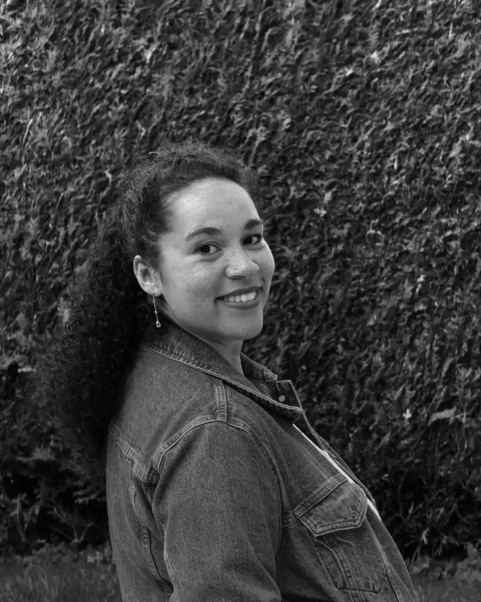

# Équipe enseignante

L'équipe pédagogique du cours Algorithmique et programmation accompagne le groupe tout au long de la semaine.

---

## Membres de l'équipe

### Clarisse Estelle Fleurimont

{ width="256", align="left" }

**Rôle** : Intervenante et formatrice

**Parcours** : Ingénieure logiciel titulaire d'un Master en Informatique Logiciel de la HES-SO et d'un certificat de formatrice d'adultes FSEA. Actuellement assistante de recherche à la HEIG-VD (Institut IICT) et formatrice pour adultes chez MOVENDO et PERFORM depuis 2022.

**Spécialités** : Développement full-stack, formation à l'intelligence artificielle et aux fondamentaux de la programmation, vulgarisation de concepts techniques pour des publics variés.

**Liens** :

- [LinkedIn](https://www.linkedin.com/in/clarisse-fleurimont-2a05481a3)
- [GitHub](https://github.com/stellucidam)
- [Site personnel](https://stellucidam.ch)

---

### Vincent Guidoux

**Rôle** : Enseignant

**Parcours** : TODO - Ajouter une brève biographie (2-3 phrases)

**Spécialités** : TODO - Domaines d'expertise

**Contact** : TODO - Adresse e-mail professionnelle

<!-- Photo : Ajouter une photo dans docs/assets/images/equipe/ -->

---

## Institution partenaire

### HEIG-VD

La Haute École d'Ingénierie et de Gestion du Canton de Vaud propose ce cours dans le cadre de la formation MSCI (Maturité Spécialisée Communication-Information).

!!! note "Ingénierie des Médias"

    Le département Ingénierie des Médias de la HEIG-VD forme des spécialistes de la communication digitale, combinant compétences techniques et créatives.

---

## Contact

Pour toute question relative au cours :

- **E-mail** : TODO - Adresse de contact principale
- **Site** : TODO - Lien vers le site du département
